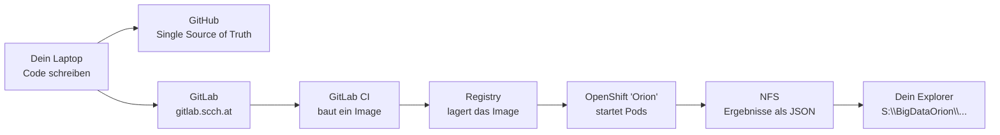

# Wie der Code von meinem Rechner auf den HPC kommt

Dieses Dokument erklärt den Weg von einer Codeänderung bis zu einer rechnenden Zelle auf dem
SCCH-Cluster **Orion** — für Leserinnen und Leser ohne Vorkenntnisse in Docker, Kubernetes oder CI.

Es beschreibt den Stand vom 2026-08-13. Die technischen Details und die Begründungen für jede
Entscheidung stehen in `DIARY.md` unter den Einträgen WP-H2 bis WP-H6.

---

## 1. Die Kurzfassung



Sechs Stationen. Du fasst nur die erste und die letzte an, alles dazwischen läuft von selbst.

---

## 2. Die vier Orte, und warum es vier sind

Am Anfang verwirrend ist, dass der Code an mehreren Stellen liegt. Jede hat genau eine Aufgabe.

| Ort | Was dort liegt | Wofür |
|---|---|---|
| **GitHub** (`github.com/dajoedic/EvoODE`) | der Code mit voller Historie | **Die Quelle der Wahrheit.** Privates Konto, bleibt dir erhalten, egal was mit dem Arbeitgeber ist |
| **GitLab** (`gitlab.scch.at/joedicke/evoode`) | eine Kopie des `main`-Branches | **Auslöser.** Ein Push hierher startet den Bau des Images |
| **Registry** (`registry.gitlab.scch.at`) | fertig gebaute Images | **Lager.** Von hier holt der Cluster sich das Image |
| **Orion** (OpenShift) | nichts dauerhaft | **Rechenmaschine.** Startet Container, wirft sie danach weg |

**Warum nicht alles auf GitLab?** Weil die institutionelle Infrastruktur dir nicht gehört. Wenn du
das SCCH verlässt, verlierst du GitLab und Orion — GitHub bleibt. Deshalb ist GitHub die Quelle und
GitLab nur ein Ziel, nie umgekehrt.

**Warum überhaupt GitLab?** Weil dort die CI läuft, die das Image baut. GitHub kann das für diesen
Cluster nicht.

---

## 3. Der Weg, Schritt für Schritt

### Schritt 1 — Du committest und pushst

```bash
git add <deine Dateien>
git commit -m "was du geändert hast"
git push origin main     # GitHub, die Quelle
git push gitlab main     # GitLab, löst den Bau aus
```

`origin` ist GitHub, `gitlab` ist das zweite Remote. Der zweite Push ist der eigentliche Auslöser.

**Nur `main` wird gepusht.** Feature-Branches bleiben auf GitHub. So kann nie halbfertiger Code auf
dem Cluster landen.

### Schritt 2 — GitLab CI baut ein Image

Hier arbeiten **zwei** Dateien zusammen, und die Arbeitsteilung ist der Schlüssel zum Verständnis:

| Datei | Beantwortet | Enthält |
|---|---|---|
| [`.gitlab-ci.yml`](../.gitlab-ci.yml) | **Wann und wo** wird gebaut? | Auslöser (nur `main`), Runner (`cpu`), Anmeldung an der Registry, Namensschilder, Zeitlimit |
| [`containers/Dockerfile`](../containers/Dockerfile) | **Was** kommt ins Image? | Linux-Basis, Julia 1.12.6, welche Verzeichnisse kopiert werden, Paketinstallation, Vorkompilierung |

Deshalb steht in `.gitlab-ci.yml` nichts von Julia. Dort steht im Kern nur eine Zeile:

```yaml
docker build --pull -f containers/Dockerfile ... .
```

Also: „Bau mir ein Image nach dem Rezept in `containers/Dockerfile`." Das **Rezept** ist das
Dockerfile, und dort beginnt alles mit:

```dockerfile
FROM julia:1.12.6-bookworm
```

Ein fertiges Debian-Linux mit exakt dieser Julia-Version, bereitgestellt von den Julia-Entwicklern.
Darauf kopiert das Dockerfile deinen Code, installiert die Pakete aus `Manifest.toml` und
kompiliert sie vor.

**Merksatz:** `.gitlab-ci.yml` ist der Auftrag, `Dockerfile` ist das Rezept. Wer wissen will, was im
Image steckt, schaut ins Dockerfile.

Das Ergebnis ist ein **Docker-Image**.

Ein Image ist ein eingefrorenes Dateisystem: Linux, Julia 1.12.6, dein Code, alle Pakete, alles
vorkompiliert. Es ist kein Programm, das läuft, sondern eine Vorlage, aus der man beliebig viele
identische laufende Kopien erzeugen kann.

Das dauert rund **40 Minuten**, weil Julia dabei den kompletten Paketbaum vorkompiliert. Diese Zeit
zahlst du **einmal pro Commit** — dafür starten später alle 756 Rechenzellen in Sekunden.

Zu sehen unter: `gitlab.scch.at/joedicke/evoode` → **Build → Pipelines**

### Schritt 3 — Das Image landet in der Registry

Am Ende des Baus schiebt die CI das Image in die Registry, mit **zwei Namensschildern**:

```
registry.gitlab.scch.at:443/joedicke/evoode:be6bf99d1b751d6ef748769336bbfa8e4e06314a
registry.gitlab.scch.at:443/joedicke/evoode:main
```

Das erste ist der **Commit-Hash**, das zweite der Branchname. Warum beides, steht in Abschnitt 5.

Zu sehen unter: **Deploy → Container Registry**

#### Warum dort keine Größe steht

Images bestehen aus **Schichten**, und Schichten werden zwischen Images geteilt. Die Linux-Basis und
die Julia-Installation sind in jedem deiner Images dieselbe Schicht, physisch nur einmal gespeichert.
Eine Größe pro Namensschild wäre deshalb irreführend — sie würde geteilte Schichten mehrfach zählen.

Was sich bei jedem Bau **wirklich** ändert, ist die große Schicht mit deinem Code und dem
vorkompilierten Julia-Depot. Die ist rund 2 GB und kommt pro Commit einmal dazu.

#### Räumt man auf?

Nicht zwingend, aber irgendwann sinnvoll. GitLab kann das automatisch: **Settings → Packages and
registries → Clean up image tags** — etwa „behalte die letzten zehn, lösche alles älter als 90 Tage".

**Eine Warnung dazu, und sie ist wichtig:** Das Image der Kampagne darf **niemals** weggeräumt
werden. Jeder Ergebnisdatensatz verweist über den Commit-Hash auf genau dieses Image; verschwindet
es, ist die Kette von Ergebnis zu ausführbarem Code unterbrochen und die Kampagne nicht mehr
nachvollziehbar reproduzierbar. Eine Aufräumregel muss den Kampagnen-Tag also ausdrücklich
verschonen.

Deshalb **vor** dem Kampagnenstart einen Git-Tag setzen:

```bash
git tag phaseB-v1
git push gitlab phaseB-v1
```

Die CI baut auch für Git-Tags (`rules: - if: $CI_COMMIT_TAG`) und benennt das Image dann nach dem
Tag. Das Kampagnen-Image heißt anschließend `…/evoode:phaseB-v1` — ein sprechender, stabiler Name
statt einer 40-stelligen Hexadezimalzahl. Eine spätere Aufräumregel kann solche Namen gezielt
schützen, und in Veröffentlichungen lässt sich `phaseB-v1` zitieren.

### Schritt 4 — Du startest die Rechnung

Jetzt kommst wieder du ins Spiel. Auf deinem Rechner läuft `oc`, das Kommandozeilenwerkzeug für
OpenShift. Du schickst eine YAML-Datei hin, die beschreibt, *was* gerechnet werden soll:

```powershell
oc apply -f manifest.yaml
```

Diese Datei nennt das Image, wie viele Zellen laufen sollen, wie viel Speicher jede bekommt und wo
die Ergebnisse hin sollen. Der Cluster liest das, holt sich das Image aus der Registry und startet
die entsprechende Zahl Container.

Die Vorlagen liegen im Repository:

- [`k8s/phase_b_bootstrap_smoke_job.yaml`](../k8s/phase_b_bootstrap_smoke_job.yaml) — der Bootstrap
- [`k8s/phase_b_indexed_smoke_job.yaml`](../k8s/phase_b_indexed_smoke_job.yaml) — die Rechenzellen

Beide enthalten `<COMMIT_SHA>` als Platzhalter, der vor dem Anwenden ersetzt werden muss.

#### Es braucht zwei Manifeste, nicht eines

**Der Bootstrap** läuft **einmal** und erzeugt zwei Dinge auf dem Netzwerkspeicher:

- `manifest.csv` — die Liste aller 756 Kampagnenzellen, jede Zeile eine Kombination aus System,
  Variante, Startbedingung und Zufallssaat
- `indices_dim1.txt` bis `indices_dim4.txt` — welche Zeilen zu welcher Systemdimension gehören

**Die Rechenzellen** laufen danach, viele gleichzeitig, und **lesen** diese Dateien nur.

Warum getrennt? Würde jede der 756 Zellen das Manifest selbst erzeugen, schrieben 756 Prozesse
gleichzeitig auf dieselbe Datei. Im besten Fall Verschwendung, im schlechteren widersprechen sich
zwei Zellen darüber, was Zeile 400 bedeutet.

Erzeugt wird es **im Container**, nicht auf deinem Laptop — sonst könnte das Manifest aus anderem
Code stammen als die Zellen, die es abarbeiten.

#### Woher weiß der Pod, welches Julia-Skript er ausführen soll?

Aus dem Feld `command:` im Manifest:

```yaml
command:
  - julia
  - --project=/opt/EvoODE
  - /opt/EvoODE/studies/regression/run_k8s_indexed_cell.jl
```

Das ist wörtlich die Kommandozeile, die im Container ausgeführt wird. `/opt/EvoODE` ist der Ort, an
den das Dockerfile deinen Code kopiert hat.

Deshalb unterscheiden sich Bootstrap und Zellen: **gleiches Image, anderes `command:`**.

| Manifest | ausgeführtes Skript |
|---|---|
| Bootstrap | `generate_phase_b_manifest.jl` |
| Rechenzellen | `run_k8s_indexed_cell.jl` |

Das Dockerfile legt zusätzlich einen Standardbefehl fest (`ENTRYPOINT`), der greift, wenn ein
Manifest **kein** `command:` angibt. Wir geben es immer explizit an — dann steht im Manifest, was
tatsächlich passiert, statt es im Dockerfile nachschlagen zu müssen.

Und woher weiß die Zelle, **welche** der 756 Zeilen sie rechnen soll? Aus ihrer Nummer, siehe
Abschnitt 6.

### Schritt 5 — Die Ergebnisse landen in deinem Explorer

Jede Zelle schreibt am Ende eine JSON-Datei auf den Netzwerkspeicher. Und dieser Speicher ist
derselbe, den du als Laufwerk `S:` siehst:

```
im Container:   /outputs/…/tasks/cell_000139.jsonl
bei dir:        S:\BigDataOrion\data-science\joedicke\…\tasks\cell_000139.jsonl
```

Du kannst also **live zuschauen**, während der Cluster rechnet, ohne dich irgendwo anzumelden.

---

## 4. Die Begriffe, in Alltagssprache

| Begriff | Was es ist |
|---|---|
| **Image** | Eine eingefrorene Festplatte mit allem drauf. Wird gebaut, dann nie wieder verändert |
| **Container** | Ein laufendes Exemplar eines Images. Startet, rechnet, verschwindet |
| **Pod** | Kubernetes' Wort für „ein laufender Container plus Drumherum" |
| **Job** | Eine Rechnung, die **fertig wird**. Läuft bis zum Ende, dann `Completed` |
| **Deployment** | Ein Dienst, der **laufen soll**. Wird bei Absturz neu gestartet. Brauchst du nicht |
| **Namespace** | Dein abgetrennter Bereich auf dem Cluster. Bei dir: `scch-das` |
| **Registry** | Das Lager für Images |
| **Runner** | Die Maschine, die die CI ausführt. Bei uns `ALEXANDRIA` |
| **NFS** | Netzwerkspeicher, den alle Pods gemeinsam sehen. Bei dir Laufwerk `S:` |
| **Manifest** | Eine YAML-Datei, die beschreibt, was der Cluster tun soll |
| **`oc`** | Das Kommandozeilenwerkzeug für OpenShift |
| **`kubectl`** | Dasselbe für normales Kubernetes. `oc` kann alles, was `kubectl` kann, und mehr |

**Die wichtigste Unterscheidung:** *Image* ist die Vorlage, *Pod* ist die laufende Kopie. 756 Pods
aus einem Image bedeuten 756-mal exakt derselbe Code.

---

## 5. Was eingestellt ist, und warum

Diese Entscheidungen sehen wie Kleinigkeiten aus. Jede einzelne wurde durch einen konkreten Fehler
erzwungen oder verhindert einen.

### Das Image trägt den Commit-Hash als Namensschild

```yaml
image: registry.gitlab.scch.at:443/joedicke/evoode:be6bf99d1b75…
```

Nicht `:main`. Der Grund ist der wichtigste im ganzen Dokument.

Jeder Ergebnisdatensatz notiert den Git-Commit, aus dem er stammt. Eine Kampagne, deren Zellen auf
**verschiedenen** Codeständen liefen, ist wissenschaftlich wertlos — und der Fehler wäre unsichtbar,
weil jeder Datensatz brav *irgendeinen* Hash nennt.

`:main` wandert bei jedem Push weiter. Ein Pod, der morgens startet, und einer, der abends startet,
bekämen unterschiedlichen Code unter demselben Namen. Der Commit-Hash wandert nicht. Damit ist der
Fehler **baulich ausgeschlossen** statt durch Disziplin vermieden.

### Julia kompiliert für zwei Prozessortypen

```dockerfile
JULIA_CPU_TARGET="generic;znver3,clone_all"
```

Julia legt beim Vorkompilieren echten Maschinencode ab, und der wird beim Start gegen die CPU
geprüft. Der Bau-Rechner ALEXANDRIA ist ein Intel, die Orion-Knoten sind AMD EPYC. Ohne diese Zeile
verwirft Julia den kompletten vorkompilierten Bestand und übersetzt neu — **46 Minuten pro Pod**,
mal 756.

Mit der Zeile: **22 Sekunden.** Die Einstellung erzeugt Code für einen portablen Grundstock *und*
für die AMD-Architektur, sodass beide Seiten etwas Brauchbares finden.

### Die CI braucht einen Docker-Hilfsdienst

```yaml
services:
  - name: docker:29-dind
    alias: docker
variables:
  DOCKER_TLS_CERTDIR: ""
```

Der GitLab-Runner erwartet, dass man einen Docker-Dienst mitstartet („Docker-in-Docker"). Ohne
diesen Block scheitert der Bau sofort mit `dial tcp: lookup docker … server misbehaving`.

### Gebaut wird auf dem CPU-Runner

```yaml
tags:
  - cpu
```

Es gibt zwei Runner: `GOLDBERG` mit GPUs und `ALEXANDRIA` ohne. Ein Julia-Bau profitiert von einer
GPU **nicht im Geringsten** — sie zu belegen würde nur anderen die knappe Ressource wegnehmen.

### Jeder Pod trägt einen Namensschild mit Verantwortlichem

```yaml
hpc.scch.at/service: evoode-phase-b-cells
hpc.scch.at/responsibility: joedicke
```

Sieht nach Bürokratie aus, ist aber deine Versicherung. Der Cluster-Betrieb hat zugesagt, Jobs in
Ruhe zu lassen und **vorher Bescheid zu geben**, falls etwas auffällt — ausdrücklich unter der
Bedingung, dass die Workload identifizierbar ist. Ohne diese zwei Zeilen sieht jemand einen Pod, der
seit 40 Stunden rechnet, und hat niemanden zu fragen.

### Gescheiterte Pods bleiben stehen

```yaml
restartPolicy: Never
```

Bei der Alternative `OnFailure` **löscht** Kubernetes den gescheiterten Pod, bevor es neu startet —
samt Logs. Genau so ist einmal eine Fehlermeldung verloren gegangen, und die Ursache musste
nachgestellt werden. Mit `Never` bleibt jeder Fehlschlag mit seiner Ausgabe liegen.

### Jede Zelle läuft einkernig

```yaml
JULIA_NUM_THREADS: "1"
OPENBLAS_NUM_THREADS: "1"
resources:
  limits:
    cpu: "1"
```

Nicht aus Bescheidenheit: Einkernig ist die Voraussetzung dafür, dass jede Zelle bei gleichem Seed
**exakt dasselbe** Ergebnis liefert. Die Parallelität kommt nicht aus dem Code, sondern daraus, dass
viele unabhängige Zellen gleichzeitig laufen.

---

## 6. Wie viele gleichzeitig? — `completions` und `parallelism`

```yaml
completionMode: Indexed
completions: 756      # so viele Zellen insgesamt
parallelism: 16       # so viele gleichzeitig
```

Kubernetes gibt jedem Pod eine laufende Nummer in der Umgebungsvariablen `JOB_COMPLETION_INDEX`.
Der Code schlägt damit in einer Liste nach, welche Zeile des Kampagnen-Manifests er rechnen soll.

**Achtung, klassische Fehlerquelle:** Diese Nummer beginnt bei **0**, Zeilennummern in Dateien bei
**1**. Eine wörtliche Übersetzung überspringt die erste Zelle und liest einmal über das Listenende
hinaus — leise, mit 755 plausibel aussehenden Ergebnissen.

`parallelism` ist die Höflichkeitsschraube. Der ganze Cluster hat **96 Kerne** auf zwei Knoten, und
die sind eigentlich dazu da, acht GPUs zu füttern. Abgesprochen sind 16.

---

## 7. Die übliche Reihenfolge

```powershell
# 1. Anmelden (Token läuft nach einiger Zeit ab)
oc login --web https://api.orion.scch.at:6443
oc project scch-das

# 2. Einmalig: Manifest und Indexlisten erzeugen
oc apply -f bootstrap.yaml
oc wait --for=condition=Complete job/<name> --timeout=1800s
oc logs -l job-name=<name> --tail=20

# 3. Die Rechenzellen starten
oc apply -f cells.yaml

# 4. Zuschauen  (siehe eigener Abschnitt unten)
oc get jobs -l hpc.scch.at/responsibility=joedicke

# 5. Aufräumen, wenn fertig
oc delete job <name>
```

### Was läuft gerade? — der Überblicksbefehl

Weil jedes Manifest das Namensschild `hpc.scch.at/responsibility` trägt, findet **ein** Befehl
alles, was dir auf dem Cluster gehört:

```powershell
oc get jobs -l hpc.scch.at/responsibility=joedicke
```

Ausgabe lesen: `COMPLETIONS 19/28` heißt neunzehn von achtundzwanzig Zellen fertig, `DURATION` ist
die bisherige Laufzeit des Jobs.

Feiner, auf Ebene der einzelnen Zellen:

```powershell
oc get pods -l hpc.scch.at/responsibility=joedicke
```

`Running` rechnet, `Completed` ist fertig, `Error` ist gescheitert. Die Nummer im Pod-Namen
(`…-sweep-**7**-x7vw2`) ist der Completion-Index und sagt dir, welche Manifestzeile dort läuft.

Weitere nützliche Befehle, alle mit demselben Namensschild:

```powershell
# Ressourcenverbrauch der laufenden Zellen — CPU und Speicher
oc adm top pod -l hpc.scch.at/responsibility=joedicke

# Nur die gescheiterten anzeigen
oc get pods -l hpc.scch.at/responsibility=joedicke --field-selector=status.phase=Failed

# Ausgabe einer bestimmten Zelle (Name aus 'oc get pods')
oc logs <pod-name> --tail=20

# Warum hängt ein Pod? Die letzten Zeilen unter 'Events:' sind entscheidend
oc describe pod <pod-name>

# Warten, bis ein Job fertig ist, und dann von selbst zurückkehren
oc wait --for=condition=Complete job/<name> --timeout=3600s
```

> **Hinweis:** `oc logs job/<name>` funktioniert nur, solange ein Pod **läuft**. Bei fertigen oder
> gescheiterten Jobs immer den Pod-Namen verwenden, sonst kommt `timed out waiting for the
> condition`.

### Und was ohne Anmeldung geht

Diese Befehle brauchen eine gültige Anmeldung. Der Token läuft nach einiger Zeit ab — die
**laufenden Jobs stört das nicht**, nur dein Werkzeug.

Ohne Anmeldung siehst du über Laufwerk `S:` trotzdem alles, was du zum Mitverfolgen brauchst.

**Wie viele Zellen sind fertig?**

```powershell
Get-ChildItem "S:\BigDataOrion\data-science\joedicke\<lauf>\tasks\*.jsonl" |
  Where-Object { $_.Name -notlike "*heartbeat*" } | Measure-Object | Select-Object Count
```

**Wo steht jede laufende Zelle gerade?** Diese Übersicht ist das eigentliche Arbeitswerkzeug:

```powershell
Get-ChildItem "S:\BigDataOrion\data-science\joedicke\<lauf>\tasks\*.heartbeat.jsonl" |
  ForEach-Object {
    $e = (Get-Content $_.FullName -Tail 1) | ConvertFrom-Json
    $l = if ($e.event -eq 'complete') { $e.loss } else { $e.best_loss }
    [pscustomobject]@{
      Sys      = $e.system_id
      Status   = $e.event
      Level    = $e.level
      Stage    = if ($e.event -eq 'complete') { $e.final_stage } else { $e.stage }
      Loss     = "{0:e2}" -f [double]$l
      StillMin = [int]((Get-Date) - [datetime]::Parse($e.timestamp).ToLocalTime()).TotalMinutes
    }
  } | Sort-Object Status, Sys | Format-Table -AutoSize
```

Eine Zeile pro Zelle, mit Level, Stage, Loss — und `StillMin`, den Minuten seit dem letzten
Fortschrittseintrag. Fertige und laufende Zellen stehen nebeneinander, sortiert nach Status.

Im Pfad sind Platzhalter erlaubt: `pilot_sweep*_tasks` erfasst mehrere Läufe auf einmal.

> **Die Heartbeat-Felder heißen je nach Ereignis anders**, und das ist die häufigste Stolperfalle
> beim Auswerten:
>
> | Ereignis | Loss-Feld | Stage-Feld |
> |---|---|---|
> | `level` (läuft) | `best_loss` | `stage` |
> | `complete` (fertig) | `loss` | `final_stage` |
>
> Wer nur `best_loss` liest, bekommt für alle fertigen Zellen eine leere Spalte — ohne Fehler.

> **`StillMin` ist die wichtigste Spalte.** Sie unterscheidet „rechnet langsam" von „hängt". Beim
> ersten Pilotlauf lagen die meisten Zellen bei wenigen Minuten pro Level, während eine einzelne
> seit über vier Stunden keinen Eintrag mehr geschrieben hatte. Ohne diese Spalte sieht beides
> gleich aus.

Für „läuft es noch und wie weit ist es" ist dieser Weg meist der bequemere: kein Token, keine
Anmeldung, alle Zellen auf einen Blick.

### Warum das Einzeiler sind und keine `.ps1`-Datei

Naheliegend wäre, so etwas in ein Skript zu schreiben. Auf einem verwalteten Firmenrechner
scheitert das aber an der PowerShell-Ausführungsrichtlinie:

```text
... cannot be loaded because running scripts is disabled on this system.
```

Umgehen ließe sich das mit `-ExecutionPolicy Bypass` oder einer dauerhaften Änderung per
`Set-ExecutionPolicy`. Beides sind Eingriffe in eine Sicherheitseinstellung, die die IT bewusst
gesetzt hat — für eine Statusabfrage ein schlechtes Geschäft. Deshalb stehen die Befehle hier so,
dass sie direkt in die Konsole eingefügt werden können.

**Die Reihenfolge 2 vor 3 ist zwingend.** Die Zellen lesen das Manifest, das der Bootstrap anlegt.

**Ohne Anmeldung zuschauen** geht auch — über den Explorer:

```powershell
Get-ChildItem "S:\BigDataOrion\data-science\joedicke\<lauf>\tasks\*.heartbeat.jsonl" |
  ForEach-Object { "{0}: {1}" -f $_.Name, (Get-Content $_.FullName -Tail 1) }
```

Das zeigt für jede laufende Zelle den letzten Fortschrittseintrag. Praktischer als jedes Log, weil
es alle Zellen auf einmal abdeckt.

---

## 8. Was schiefgehen kann, und woran man es erkennt

Alle diese Fälle sind tatsächlich aufgetreten.

| Symptom | Ursache | Abhilfe |
|---|---|---|
| `ImagePullBackOff`, scheitert nach 1 s | Das Zugangsgeheimnis gilt nicht für dein Projekt | Deploy-Token mit `read_registry` anlegen, daraus ein eigenes Secret |
| `OOMKilled` | Speicherlimit zu niedrig | Wert im Manifest erhöhen. RAM ist auf Orion reichlich vorhanden |
| Pod läuft 40 min, bevor er rechnet | `JULIA_CPU_TARGET` fehlt | siehe Abschnitt 5 |
| `dial tcp: lookup docker … server misbehaving` | Docker-Hilfsdienst fehlt in der CI | `services:`-Block ergänzen |
| Job `Failed`, keine Logs mehr da | `restartPolicy: OnFailure` hat den Pod gelöscht | Auf `Never` umstellen |
| `You must be logged in to the server` | Token abgelaufen | Neu anmelden. **Die laufenden Jobs stört das nicht** |
| Job `Pending`, „waiting for runner" | Der Tag passt zu keinem Runner | Tag im Manifest prüfen |

**Wichtig:** `Completed` heißt nur, dass das Programm ohne Absturz endete — **nicht**, dass das
Ergebnis brauchbar ist. Fehler werden im Datensatz im Feld `error` festgehalten, und der Pod endet
trotzdem sauber. Immer prüfen:

```powershell
Select-String -Path "S:\...\tasks\*.jsonl" -NotMatch -Pattern '"error":null'
```

Was hier ausgegeben wird, ist fehlerhaft.

---

## 9. Wo die konkreten Werte stehen

| Was | Wert |
|---|---|
| Namespace | `scch-das` |
| API-Adresse | `https://api.orion.scch.at:6443` |
| Web-Oberfläche | `https://console-openshift-console.apps.orion.scch.at/` |
| Image | `registry.gitlab.scch.at:443/joedicke/evoode:<commit-hash>` |
| Zugangsgeheimnis | `evoode-gitlab-pull` |
| NFS-Server | `nfs.orion.scch.at`, Export `/bigdata` |
| Arbeitsverzeichnis | `/bigdata/data-science/joedicke` = `S:\BigDataOrion\data-science\joedicke` |
| Ansprechpartner | Rainer Meindl |

Die Vorlagen liegen unter `k8s/` im Repository. Der Commit-Hash darin ist ein Platzhalter und muss
vor dem Anwenden durch den tatsächlichen ersetzt werden.

---

## 10. Was dieses Dokument nicht behandelt

- **Die wissenschaftliche Seite** — was gerechnet wird und warum: `CLAUDE.md` und `PAPER_1.md`
- **Die Chronologie** — welcher Fehler wann auftrat und wie er gefunden wurde: `DIARY.md`, Einträge
  WP-H2 bis WP-H6
- **Die Kostenrechnung** — `docs/hpc_requirements.md`. Achtung: Dieses Dokument beschreibt noch einen
  Slurm-Standort und enthält Schätzungen, die sich als um ein bis zwei Größenordnungen zu hoch
  erwiesen haben. Es wird überarbeitet, sobald die Pilotmessungen vollständig sind.
