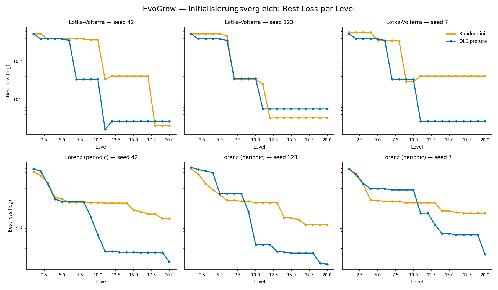

# Profiling-Studie: Initialisierungsvergleich (profile_init)

**Datum:** 2026-04-29 bis 2026-05-02  
**Skript:** `studies/profiling/profile_init.jl`  
**Status:** Abgeschlossen (12/12 Runs)

---

## Fragestellung

Bringt OLS-basiertes Pretuning (Warm-Start via Kleinste-Quadrate-Schätzung der Ableitungen)
einen messbaren Vorteil gegenüber Zufallsinitialisierung — gemessen an finalem Loss und
Rechenzeit?

## Setup

- **Systeme:** Lotka-Volterra competition (2D, expected stage 3), Lorenz periodic (3D, expected stage 3)
- **Seeds:** 42, 123, 7
- **Initialisierungsmodi:** `random` (Nullstart), `pretune` (OLS Warm-Start vor BFGS)
- **Algorithmus:** EvoGrow mit `StagedPolynomialBasis`, 20 Levels, gleiche Hyperparameter wie Paper 1
- **Abbruchbedingung:** Alle 12 Runs endeten mit `max_levels` — kein Run erreichte `loss_tol=1e-8`

---

## Ergebnisse

### Finaler Loss und Laufzeit

| System | Seed | random loss | pretune loss | random Zeit | pretune Zeit | Gewinner Loss |
|--------|------|------------|--------------|-------------|--------------|---------------|
| Lotka-Volterra | 42  | 2.00e-4 | 2.62e-4 | 0.28h | 0.60h | random |
| Lotka-Volterra | 123 | 3.19e-4 | 5.53e-4 | 3.59h | 0.68h | random |
| Lotka-Volterra | 7   | 4.05e-3 | **2.62e-4** | 0.56h | 8.37h | pretune |
| Lorenz | 42  | 14.1 | **3.14** | 5.34h | 4.96h | pretune |
| Lorenz | 123 | 11.3 | **2.87** | 6.46h | 1.32h | pretune |
| Lorenz | 7   | 16.9 | **4.06** | 8.34h | 2.56h | pretune |

### Mittlere Loss (über Seeds)

| System | random (mean) | pretune (mean) | Faktor |
|--------|--------------|----------------|--------|
| Lorenz periodic | 1.41e+01 | **3.36e+00** | ~4.2× |
| Lotka-Volterra | 1.52e-03 | **3.59e-04** | ~4.2× |

### Finaler Stage

| System | Seed | random stage | pretune stage |
|--------|------|-------------|---------------|
| Lotka-Volterra | 42  | 3 | 5 |
| Lotka-Volterra | 123 | 5 | 5 |
| Lotka-Volterra | 7   | 4 | 5 |
| Lorenz | 42  | 2 | 3 |
| Lorenz | 123 | 2 | 3 |
| Lorenz | 7   | 2 | 3 |

---

## Konvergenzkurven

*Best loss pro Level für alle 12 Runs. Obere Reihe: Lotka-Volterra, untere Reihe: Lorenz.*

---

## Interpretation

### Lorenz (3D, komplex): Pretune klar besser

Auf allen 3 Seeds zeigt Pretune deutlich niedrigeren finalem Loss (~4× Verbesserung)
und erreicht Stage 3, während Random bei Stage 2 stagniert. Die Laufzeit ist mit
Pretune zudem tendenziell kürzer (Ausnahme: seed 42 ähnlich). 

**Erklärung:** Bei komplexen Systemen liefert der OLS-Warm-Start eine substanziell
bessere Startschätzung — BFGS konvergiert schneller und landet in besseren Minima.
Der höhere Stage entspricht dabei einer echten qualitativen Verbesserung: Pretune
ermöglicht den Sprung in Stage 3 (Cross-Terme), der für Lorenz notwendig ist.

### Lotka-Volterra (2D, einfacher): Gemischtes Bild

Auf Mittelwertebene gewinnt Pretune ebenfalls (~4×), aber auf Einzelseed-Ebene
gewinnt Random bei 2 von 3 Seeds auf Loss. Pretune erreicht zwar häufiger Stage 5,
aber dies führt nicht zu niedrigerem Loss — im Gegenteil.

**Erklärung:** Für Lotka-Volterra (expected stage 3) treibt Pretune den Algorithmus
tief in höhere Stages (Stage 5), was zu Overfitting oder schlechterem Stopp-Verhalten
führt. Der OLS-Warm-Start erzeugt hier möglicherweise eine "zu gute" Initialschätzung,
die frühe Stage-Promotions begünstigt und damit die Suchstrategie destabilisiert.
Das Ergebnis: hoher Rechenaufwand (seed 7: 8.37h) ohne Loss-Gewinn.

### Kritischer Befund: `max_levels` als Abbruchbedingung

Alle 12 Runs enden mit `max_levels`, kein Run konvergiert auf `loss_tol=1e-8`.
Das bedeutet:

1. Das Level-Budget von 20 ist für diese Systeme zu gering für saubere Konvergenz.
2. Die gemessenen Losses sind "Best-effort"-Werte, keine konvergierten Lösungen.
3. ETA und Laufzeitvergleiche sind stark von Zufallseffekten geprägt (welcher
   Run findet einen guten Kandidaten in welchem Level?).

---

## Fazit

Die Hypothese "Pretuning führt generell zu schnellerer Konvergenz und niedrigerem Loss"
wird **teilweise bestätigt**:

- ✓ Für komplexe Systeme (Lorenz 3D): klar bestätigt, robust über alle Seeds
- ~ Für einfachere Systeme (Lotka-Volterra 2D): auf Mittelwertebene bestätigt,
  auf Seed-Ebene nicht zuverlässig

**Methodische Einschränkungen:** 2 Systeme, 3 Seeds, kein Run konvergiert,
`max_levels` als Abbruch. Keine belastbaren statistischen Aussagen möglich.

---

## Offene Fragen

- Warum führt Pretune bei Lotka-Volterra zu exzessiven Stage-Promotions?
  Hängt das mit dem `stage_local`-Promotionsmechanismus zusammen?
- Wäre ein höheres Level-Budget (z.B. 50) ausreichend für Konvergenz?
- Reproduziert sich der Lorenz-Befund auf weiteren Seeds und ähnlichen 3D-Systemen?
